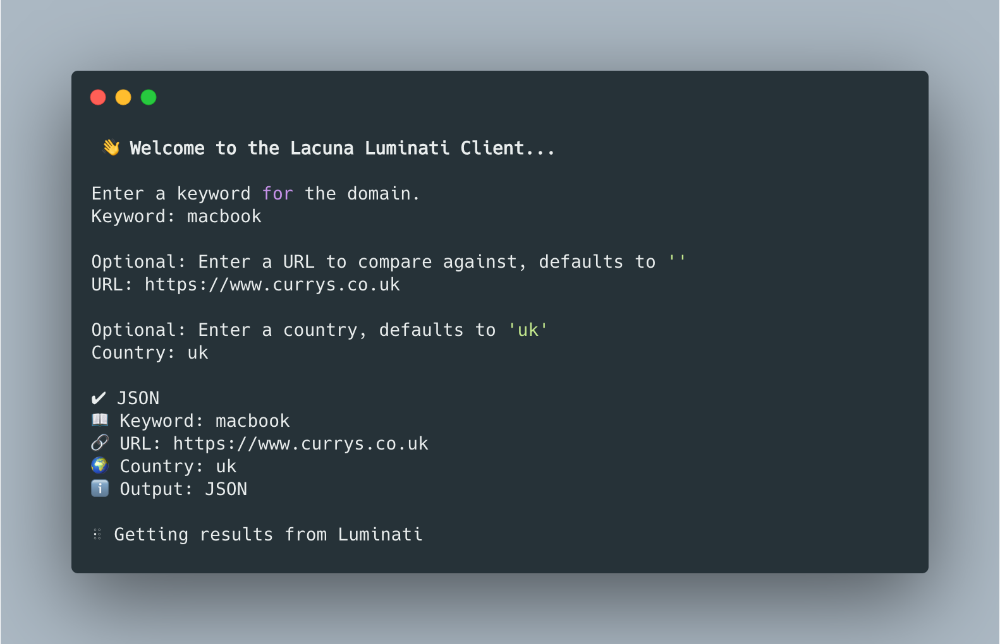

<p align="center">
    
</p>

# Luminati Client
Client for obtaining keyword data via BrightData (Luminati)

[](http://golang.org)
[](https://github.com/lacuna-seo/luminati/actions/workflows/test.yml)
[](https://goreportcard.com/report/github.com/lacuna-seo/luminati)
[](https://codecov.io/gh/lacuna-seo/luminati)

## Install

`go get github.com/lacuna-seo/luminati-client@v0.0.1`

## Usage

First create a new client and pass an instance that implements a [stash.Store](https://github.com/lacuna-seo/stash). This could be a Redis Cache, Go Cache or anything that uses
the methods defined below, these are used to decrease the calls to the BrightData (Luminati) API endpoint. The client has two methods 
`JSON` and `HTML`, both of which are described [here](https://github.com/lacuna-seo/stash).

### Export Proxy URL

```bash
export LUMINATI_URL={{ url }}
```

Or

```bash
echo 'export LUMINATI_URL={{ url }}' >> ~/.zshenv
```

### Example

```go
client, err := New()
if err != nil {
    log.Fatalln(err)
}

serps, meta, err := client.JSON(Options{
    Keyword: "macbook",
    Country: "us",
    Params:  nil,
    Desktop: false,
})
if err != nil {
    log.Fatalln(err)
}

domain := serps.CheckURL("https://www.apple.com")

fmt.Printf("Serps: %+v\n", serps)
fmt.Printf("Domain: %+v\n", domain)
fmt.Printf("Meta: %+v\n", meta)
```

## Get started

To create a new client, simply  to `New` or `NewWithCache`.

### New
Creates a new client without any cache getting or setting.

```go
// Create a new luminati client with cache expiry. Using luminati.DefaultCacheExpiry
// defaults to 8 hours.
client, err := luminati.New()
if err != nil {
    // Handle
}
```

### NewWithCache
Creates a new client with cache. Pass the instance of a `stash.Store` to the function with a default
cache expiry time.

```go
// Create a new luminati client with cache expiry. Using luminati.DefaultCacheExpiry
// defaults to 8 hours.
client, err := luminati.NewWithCache(&Cache{}, luminati.DefaultCacheExpiry)
if err != nil {
    // Handle
}
```

### Options

Both of the functions requires `Options` struct to be used to obtain Serp data.

```go
// Options contains the data used for obtaining serp
// results from the Luminati API.
type Options struct {
    // Keyword is the search term used for lookup.
    // NOTE: This is a required field.
    Keyword string
    // Country is the country to obtain data from for SERP's.
    // If nothing is passed, DefaultCountry will be used.
    Country string
    // Query is the url.Values to be sent to google. Default
    // parameters will be added if none are set such as
    // lum_mobile.
    Query url.Values
    // Desktop is the bool defining if desktop results should
    // be obtained as opposed to mobile.
    Desktop bool
    // PreventCache determines if the keyword serp data should
    // be cached, if set to true. Cache set will be skipped.
    PreventCache bool
}
```

## Meta

Meta defines the information sent back from the client. It contains a **cache key** (if the client is using the cache). The request URL 
used to perform the request and response, request and latency times. It is returned by both of the methods in the `KeywordFinder`.
```go

type Meta struct {
	// CacheKey defines the cache key that was created
	// when requesting. It's empty if no cache was used.
	CacheKey string
	// RequestURL is request URI that was sent to Luminati.
	RequestURL string
	// RequestTime is the time in which the request was
	// started.
	RequestTime time.Time
	// ResponseTime is the time in which all processing
	// was finished.
	ResponseTime time.Time
	// LatencyTime is the duration in which the client took
	// to perform the request.
	LatencyTime time.Duration
}
```

## JSON

To obtain JSON data call `.JSON()` from the client and pass in options. It returns a collection of serp data as defined
in `luminati.Serps`.

```go
serps, meta, err := client.JSON(luminati.Options{ // Returns Serp Data
    Keyword:  "macbook",
    CheckURL: "https://currys.co.uk",
    Country:  "uk",
    Query:    nil,
    Desktop:  false,
})
if err != nil {
    log.Fatalln(err)
}
fmt.Printf("%+v\n", serps)
fmt.Printf("%+v\n", meta)
```

### Checking URL's

To check Serp data against a URL, call `CheckURL` from the return data. CheckURL obtains the highest ranking 
Serp for a given URL and returns a `Domain` struct. Features are also obtained.

```go
domain := serps.CheckURL("https://www.apple.com")
fmt.Printf("%+v\n", domain)
```

## HTML
To obtain HTML data call `.HTML()` from the client and pass in options. It returns a string of html data.

```go
html, meta, err := client.HTML(luminati.Options{ // Returns Serp Data
    Keyword:  "macbook",
    CheckURL: "https://currys.co.uk",
    Country:  "uk",
    Query:    nil,
    Desktop:  false,
})
if err != nil {
    log.Fatalln(err)
}
fmt.Println(html)
fmt.Printf("%+v\n", meta)
```

## Errors 

You are able to establish if the Luminati Client error returned by any of the functions is a timeout error by using
`luminati.ErrClientTimeout`. You can see an example below.

```go
_, err := c.JSON(luminati.Options{})
if err != nil && err == luminati.ErrClientTimeout {
    // The error is timeout related
} else if err != nil {
    // General error
}
```

## CLI Usage
To use the CLI you can either run from source or use the prebuilt exec. You wil be able to pass in arguments 
to obtain SERP Data when running.

### Run from built
`cd ./cmd && ./luminati`

### Run from source
- `make setup`
- `make run`
